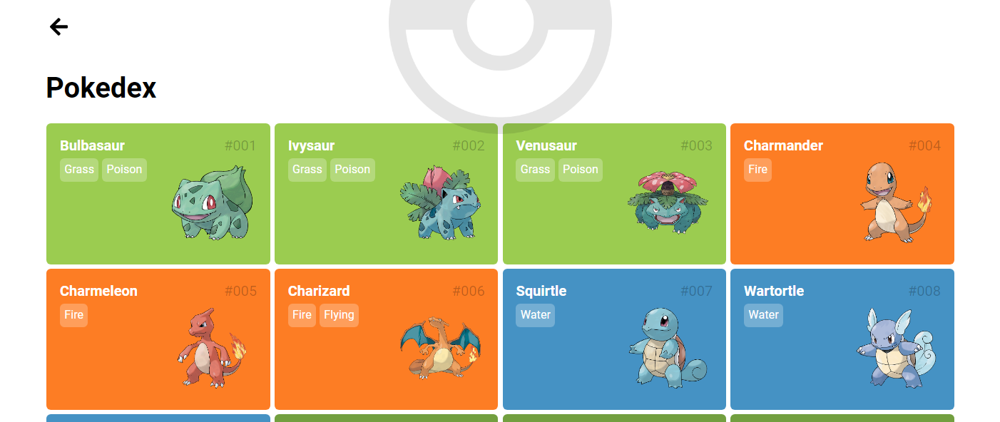
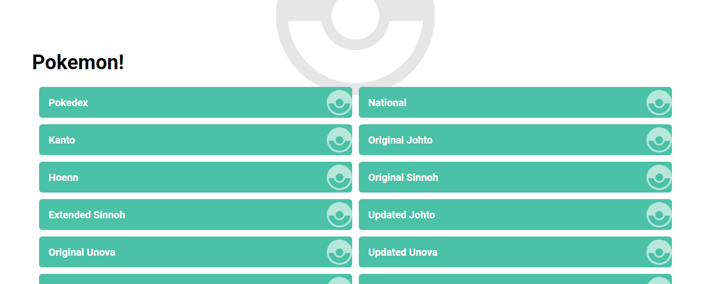
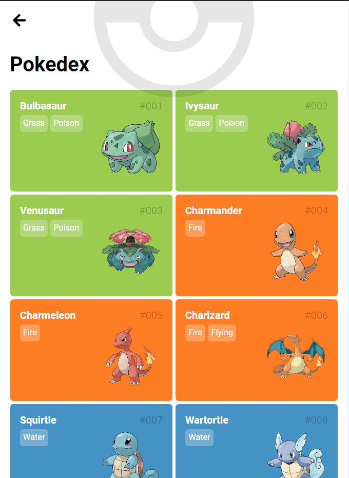
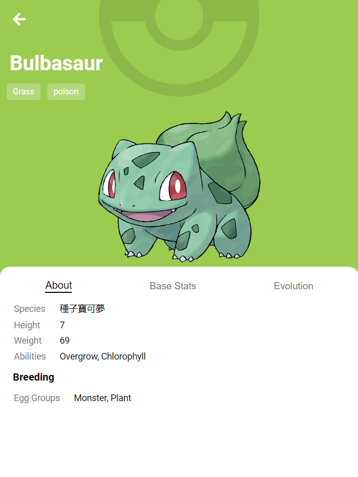

<p align="center">
  🐹⚡ React Pokedex
</p>

<p align="center">
  
  
</p>



🐹⚡ React Pokedex

This is a project used to learn concepts of ReactJS.

<p align="center">
  
  <table>
    <tr>
      <td>
        
      </td>
      <td>
        
      </td>
    </tr>
  </table>
</p>

## Design From

* **Pokedex App** by [Saepul Nahwan](https://dribbble.com/saepulnahwan23) - https://dribbble.com/shots/6545819-Pokedex-App

## 🏃 Getting Started

First, clone this repository and access the created folder:

```bash
# Cloning repository
git clone https://github.com/iamtheluiz/reactPokedex.git

cd reactPokedex/
```

## 👨🏽‍💻 Usage

Just run `start` script.

```bash
yarn start
```

## ⚙️ Building

To generate the project package just run:

```bash
yarn build
```

## 💼 Authors

* **Luiz Gustavo** - *Development* - [iamtheluiz](https://github.com/iamtheluiz)
  * Website: https://iamtheluiz.github.io
  * Github: [@iamtheluiz](https://github.com/iamtheluiz)
  * LinkedIn: [Luiz Gustavo da Silva Vasconcellos](https://www.linkedin.com/in/luiz-gustavo-da-silva-vasconcellos)
